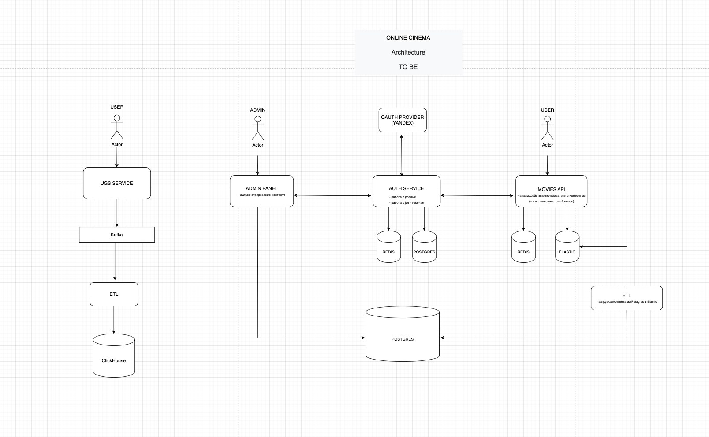

# ONLINE CINEMA SERVICE

## [Ссылка на репозиторий](https://github.com/SmirnovaT/ugc_sprint_1)

## Запуск проекта 
### В контейнерах (боевой вариант)

Скопировать `.env.example` в `.env`. Скопировать `./etl/.env.example` в `./etl.env` (для ETL сервиса)

```console
docker compose up --build
or
docker compose up --build -d
```

### Локальный запуск
Скопировать `.env.local.example` в `.env`. Необходимую для локального запуска сервисов инфраструктуру можно поднять запустив боевой вариант с прокинутыми наружу необходимыми портами в файле `docker-compose.override.yml` (уже настроены). 

```console
<!-- запустить сервисы в докере -->
docker compose up  -d
<!-- установить зависимости используя poetry  -->
poetry install
poetry run python src/main.py
```

#### Запуск ETL сервиса локально
 Скопировать `./etl/.env.local.example` в `./etl.env`

```console
cd etl
python -m venv venv
source venv/bin/activate
python -m pip install -r requirements.txt
python main.py
```

____________________________________________________________________________
[Результаты тестирования Vertica](test_db/test_vertica/result.md)

[Результаты тестирования ClickHouse](test_db/test_clickhouse/result.md)

____________________________________________________________________________
Architectural diagram AS IS
____________________________________________________________________________


____________________________________________________________________________
Architectural diagram TO BE
____________________________________________________________________________

